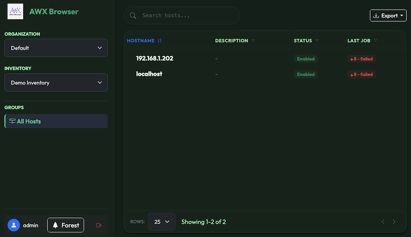
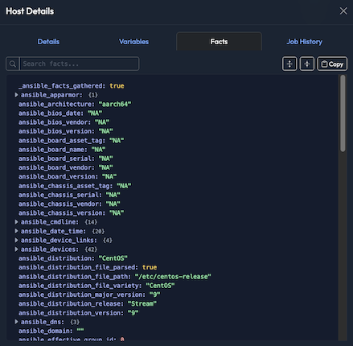

# AWX Browser

A modern, premium-designed web interface for visualizing and interacting with your [Ansible AWX](https://github.com/ansible/awx) or Red Hat Ansible Automation Platform inventories.






## ✨ Features

- **Modern & Themed UI**:
  - A sleek interface built with Bootstrap 5 and Glassmorphism design principles.
  - **6 Professional Themes**: Midnight (Default), Light, Nord, Cyberpunk, Forest, and Sunset.
- **Hierarchical Browsing**: Interact with Organizations, Inventories, and Groups via an interactive tree view.
- **Advanced Host Management**:
    - **Live Filters**: Real-time searching by name or description.
    - **Host Details**: Inspect configuration, **JSON/YAML variables**, and full **Job History**.
    - **Ansible Facts Viewer**: A powerful, searchable recursive JSON viewer to inspect deep nested facts.
- **Data Export**: Download your filtered host lists as **CSV**, **Excel (.xlsx)**, or view as a printable **HTML Report**.
- **Security Hardened**:
    - Full **CSRF Protection** on forms.
    - **Server-Side Sessions** (Filesystem) to protect credentials.
    - **XSS-proof** rendering for safe data updates.
- **Secure Authentication**: Connect using your AWX Credentials (AD/LDAP supported) or a Personal Access Token.

## 🚀 Getting Started

### Prerequisites

- Python 3.12+ (Recommended)
- Access to a running AWX/Tower instance

### Installation (Local)

1. **Clone the repository**:
    ```bash
    git clone https://github.com/lepicodon/awx-browser.git
    cd awx-browser
    ```

2. **Create a virtual environment**:
    ```bash
    conda create -n awx-browser python=3.12
    conda activate awx-browser
    ```

3. **Install dependencies**:
    ```bash
    pip install -r requirements.txt
    ```

4. **Run the application**:
    ```bash
    python app.py
    ```

5. **Open your browser**:
   Navigate to `http://localhost:5000`.

### 🐳 Deployment (Docker & K8s)

This application is container-ready and stateless.

#### Docker
1. **Build the image**:
    ```bash
    docker build -t awx-browser .
    ```

2. **Run the container**:
    ```bash
    # Optionally pass AWX_BASE_URL to pre-fill the login form
    docker run -p 5000:5000 -e AWX_BASE_URL="https://awx.example.com" awx-browser
    ```

#### Kubernetes
1. **Apply the manifest**:
   Edit `kubernetes.yaml` to set your image and base URL, then:
   ```bash
   kubectl apply -f kubernetes.yaml
   ```

2. **Access**:
   Port-forward for local testing:
   ```bash
   kubectl port-forward svc/awx-browser 8080:80
   ```
   Access at `http://localhost:8080`.

## 🛠 Tech Stack

- **Backend**: Flask 3.1, Flask-Session (Server-side), Flask-WTF (CSRF)
- **Frontend**: Bootstrap 5, Vanilla JS (ES6+), Glassmorphism CSS
- **Utilities**: `requests` (API), `pyyaml`, `openpyxl` (Exports)

## 📄 License

This project is licensed under the MIT License.
